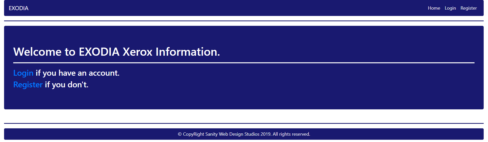
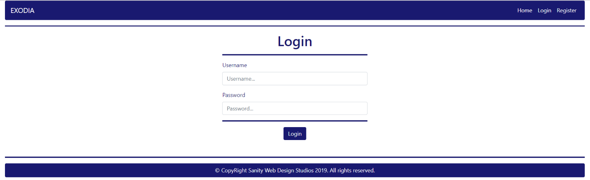
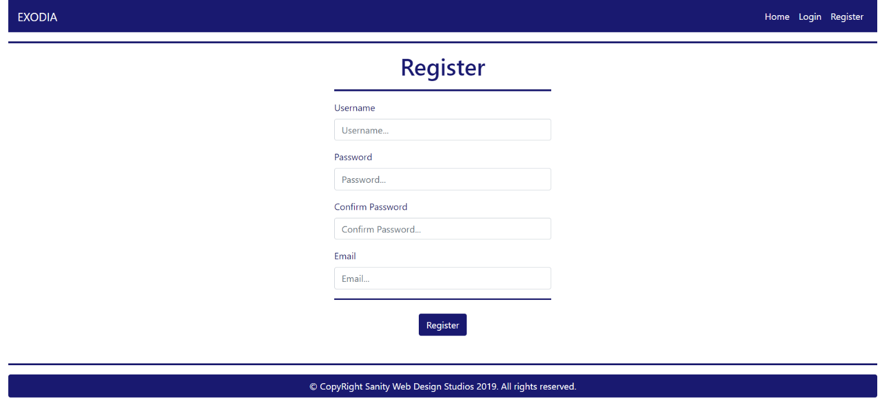
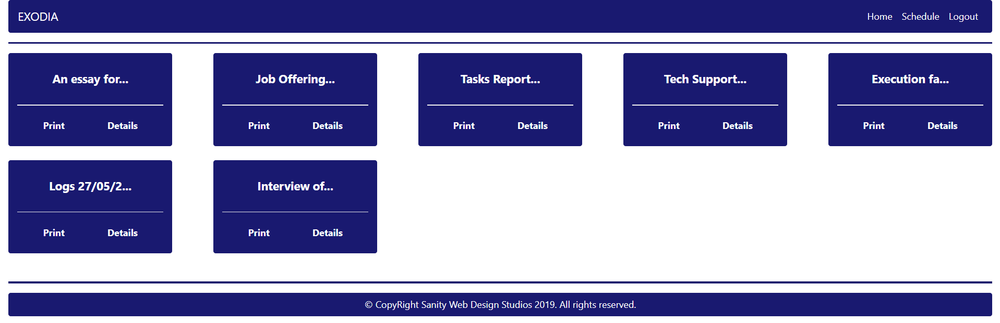
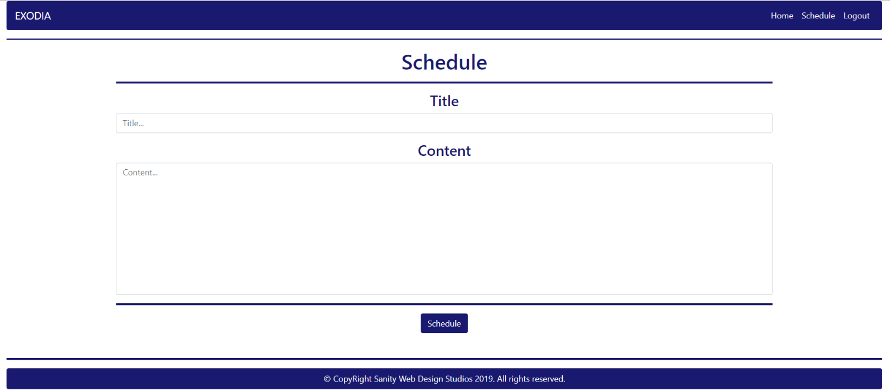
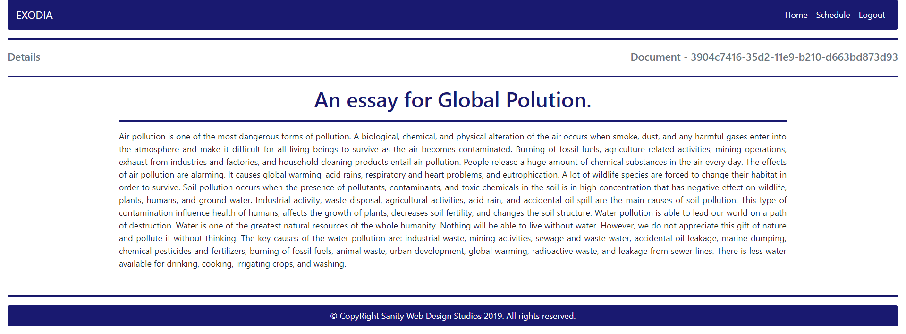
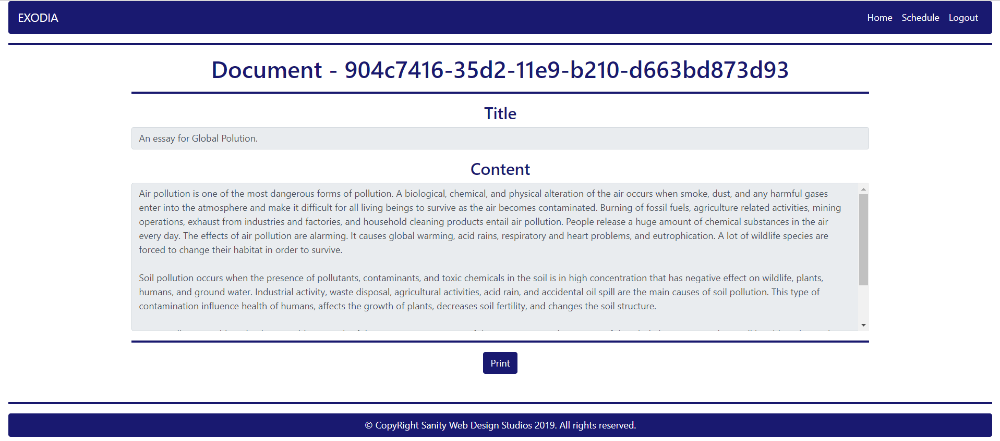

# Java Web Development Basics Regular Exam

## EXODIA

EXODIA (Enterprise Xerox Open Delivery Information Application) is an application which manages a queue of documents to be printed. Normally this process is managed by the printers (after all it’s the 21st century). However, some companies do not think like that and they use printers from BC. One such company is the ORACLE corporation (Obscurely Ruthless Amateur Crazy Lunatic Employees), which has hired you to implement the EXODIA application platform.

### Database Requirements

The Database of EXODIA needs to support 2 entities:

User

- Has an Id – a UUID String
- Has a Username
- Has a Password
- Has an Email

Document

- Has an Id – a UUID String
- Has a Title – a String
- Has a Content – a String

Implement the entities with the correct data-types and implement repositories for them. 

The Document’s Content should support very long strings.

### Page Requirements

#### Index Page (logged-out user)

#### Login Page (logged-out user)

#### Register Page (logged-out user)

#### Home Page (logged-in user)

NOTE: As you can see the elements are aligned to the left, regardless of their count. The maximum count is 5 per row, however they are always aligned to the left.

NOTE: The Documents’ Titles are visualized and trimmed to the 12-th symbol, then concatenated with a "…" (3 dots).

#### Schedule Page (logged-in user)

#### Details Page (logged-in user)

#### Print Page (logged-in user)

The templates have been given to you in the application skeleton, so make sure you implement the pages correctly. 

NOTE: The templates should look EXACTLY as shown above.

NOTE: The templates do NOT require additional CSS for you to write. Only bootstrap and the given css are enough.

### Functionality

The functionality of EXODIA is very simple.

##### Users

Guests can Register, Login and view the Index Page. 

Users can Schedule Documents to be printed. Users can also see Scheduled Documents on the Home Page, where they can also Print or view Details about each one of them.

##### Documents

Documents can be Scheduled for printing by Users. All Scheduled documents are visualized on the Home Page, each one in its own separate rectangular element. 

Documents may contain large amounts of data so only their Titles are visualized on the Home Page. Their Titles are visualized up to the 12-th symbol, followed by 3 dots ("…").

Documents are visualized on the Home Page with 2 buttons – `[Print]` and `[Details]`.

- The `[Print]` button leads to the Print Page – a simple confirmation-like page.
- The `[Details]` button leads to the Details Page – a simple details visualization page.

Printing a Document is like deleting it – it should be removed from the database of the EXODIA application.

Redirects

- Upon successful Registration of a User, you should be redirected to the Login Page.
- Upon successful Login of a User, you should be redirected to the Home Page.
- Upon successful Scheduling of a Document, you should be redirected to the Document’s Details Page.
- Upon successful Printing of a Document, you should be redirected to the Home Page.
- Upon successful Logout of a User, you should be redirected to the Index Page.

General

The application should store its data into a MySQL database, using Hibernate native.

### Security

The Security section mainly describes access requirements. Configurations about which users can access specific functionalities and pages.

- Guest (not logged in) users can access Index page.
- Guest (not logged in) users can access Login page.
- Guest (not logged in) users can access Register page.
- Users (logged in) cannot access Guest pages.
- Users (logged in) can access Home page.
- Users (logged in) can access Schedule page and functionality.
- Users (logged in) can access Print page and functionality.
- Users (logged in) can access Details page.
- Users (logged in) can access Logout functionality.

### Code Quality

Make sure you provide the best architecture possible. Structure your code into different modules, divide and conquer, follow the principles of high-quality code. You will be scored for the Code Quality and Architecture of your project.

###	Bonus

The ORACLE corporation has given you a bonus task if you think that the whole EXODIA application is easy to implement.

Extend the Printing functionality by sending a formatted PDF of the Document to the User. All other functionality stays the same.

The formatting is simple:

- If you see a line starting with (from 1 to 6) `#`, you should treat that line as a \<h1> - \<h6> element, and it should have a \
 (horizontal line after it).
- If you see a line starting with a `*` (star symbol), you should treat that line as a \<li> element inside a \<ul> element.
- If you see text wrapped in `**` (double stars) you should make that text bold.

The Title of the Document should be rendered as a centered \<h1> element with a \
 element below it.

The Content of the Document should be formatted (as specified above) and rendered below the Title. 

### Scoring

##### Database – 10 points.

##### Pages – 15 points.

##### Functionality – 30 points.

##### Security – 15 points.

##### Code Quality – 30 points.

##### Bonus – 10 points.

Resources: [Resources](../z_resources/exodia)
