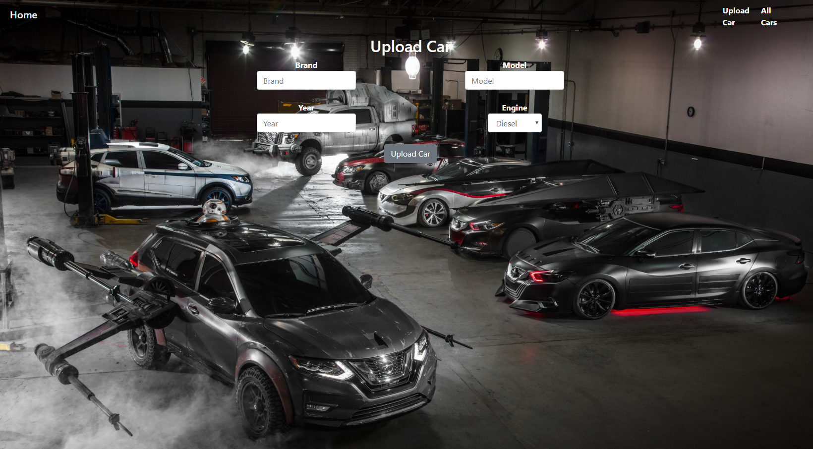
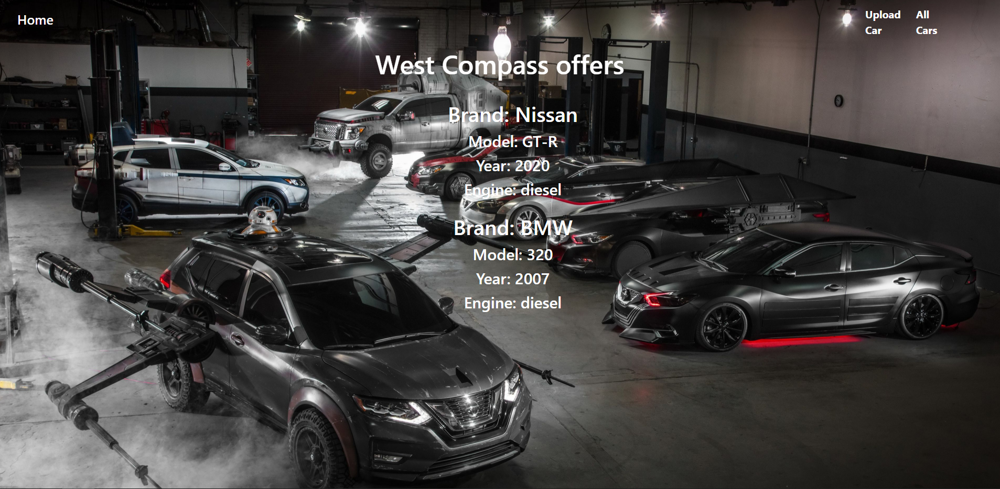

# Lab: Introduction to Java EE

## Instructions

Make sure you have `git` and `maven` installed.

Used versions:

 - Apache Maven 3.6.2
 - git version 2.23.0

Open windows console and clone the repository
```
git clone https://github.com/VasAtanasov/SoftUni-Java-Web-Basics-September-2019.git
```
Navigate to `SoftUni-Java-Web-Basics-September-2019\javaee-intro\west-compass-dealer-shop` and run the following command

```mvn clean package tomee:run```

Open the browser and navigate to http://localhost:8007

### West Compass Dealer Shop

West Compass Dealer Shop is an application in which you register cars, with several properties.

You will have to create a simple multi-Servlet application which has several pages and 1 object entity.

1 Data

This is the data layer of the application. There is 1 data object for you to implement.

Car

Create a Car class, which holds the following properties:

 - model – a String.
 - brand – a String.
 - year – an Integer.
 - engine – a String.
 
2 Home Servlet

Implement a Servlet, which listens on the index route (“/”). 

It should support only a GET request.

It should return the following HTML page, upon a `GET` request.


 
3 Car Create Servlet

Implement a Servlet, which listens on route (“/create”). 

It should support `GET` & `POST` requests.

It should return the following HTML page, upon a `GET` request.


 
4 All Cars Servlet

Implement a Servlet, which listens on route (“/all”).

It should support only a `GET` request.

It should return the following HTML page, upon a `GET` request.



Each car show


Document with tasks description: [Java-Web-Development-Basics-Introduction-to-Java-EE-Lab](../../z_resources/javaee-intro/05.Java-Web-Development-Basics-Introduction-to-Java-EE-Lab.docx)
