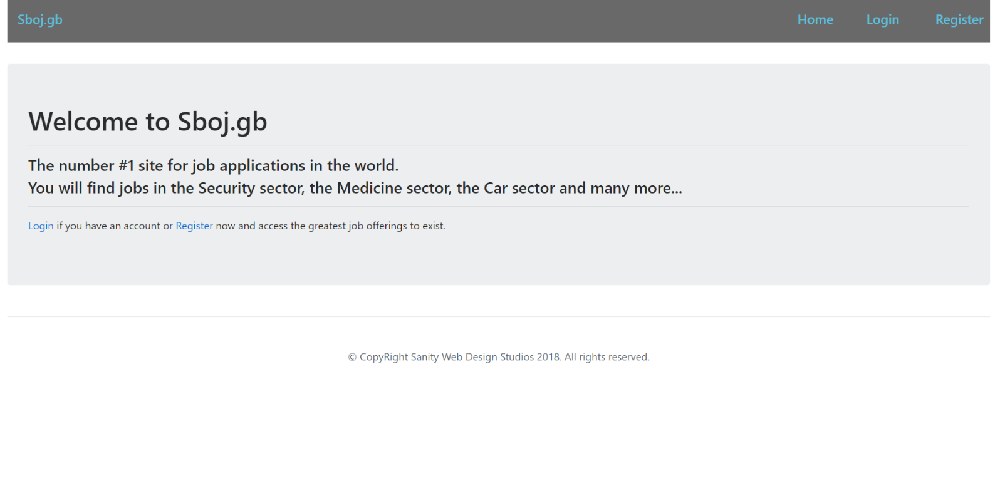
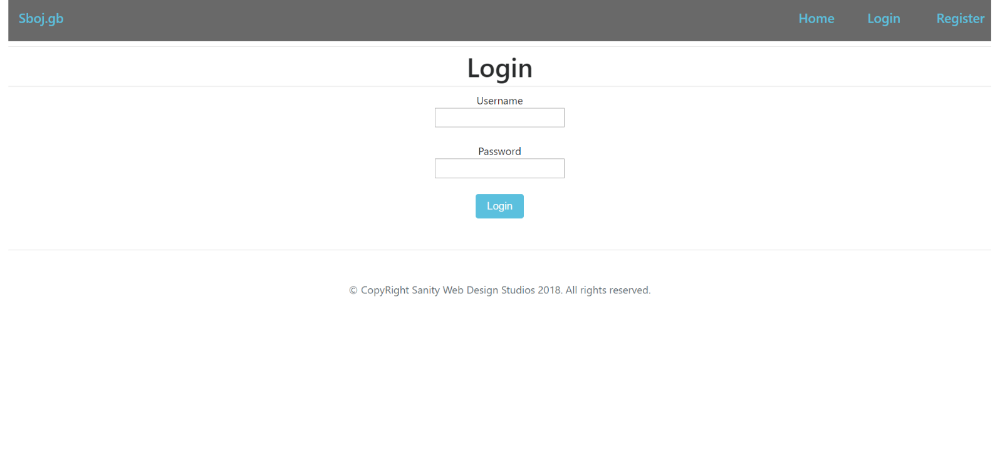
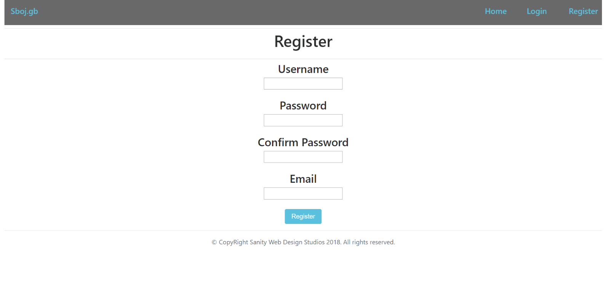
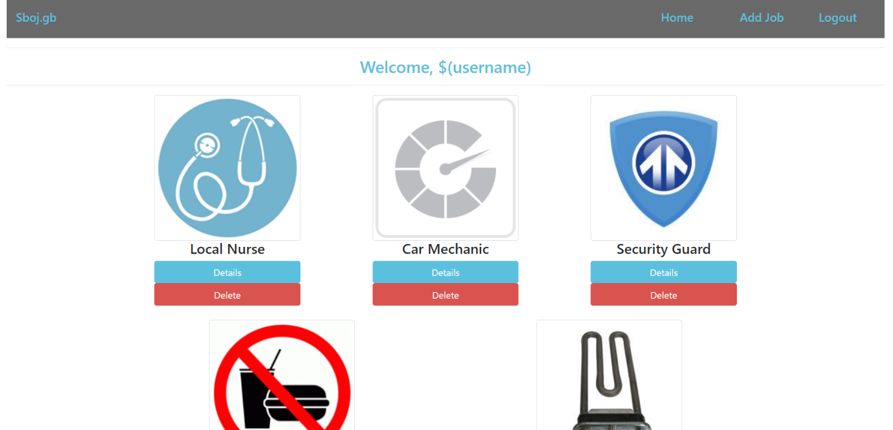
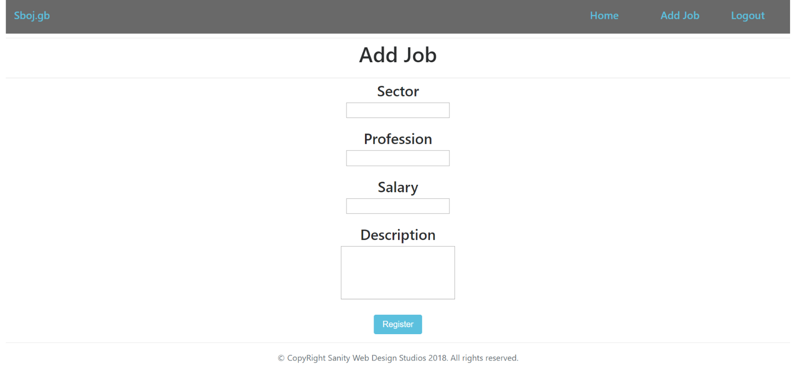
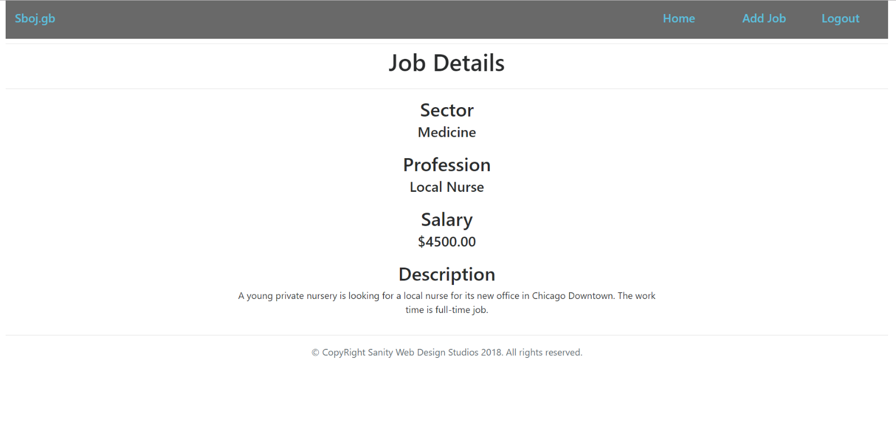
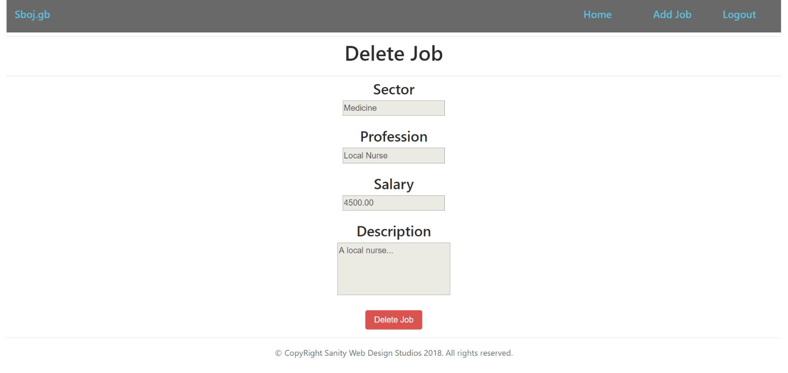

# Java Web Development Basics

## Workshop: JSF

## Instructions

Make sure you have `git` and `maven` installed.

Used versions:

- OpenJDK 13
- Apache Maven 3.6.2
- git version 2.23.0
- MySQL Community Server 8.0.17

Clone the repository.

```
git clone https://github.com/VasAtanasov/SoftUni-Java-Web-Basics-September-2019.git
```

Navigate to `SoftUni-Java-Web-Basics-September-2019\javaee-intro\west-compass-dealer-shop` and run the following command

```
mvn clean package tomee:run
```

This may take a while for maven to download all the dependencies.

A copy of Tomee version 8.0.0-M3 will be downloaded and managed by tomee maven plugin.

Open the browser and navigate to http://localhost:8007


## Sboj.gb

Sboj.gb is an application for job offers. You have been tasked to implement this application for an unusually low price, by an unusually rich client. There are several requirements you must follow in the implementation.

1 Database Requirements

The Database of the Sboj.gb application needs to support 2 entities:

#### User

- Has an Username
- Has a Password
- Has an Email

#### Job Application

- Has a Sector
- Has a Profession
- Has a Salary
- Has a Description

Implement the entities with the correct data-types, and implement repositories for them.

### Page Requirements

#### Index Page (logged out user)


 
#### Login Page (logged out user)


 
#### Register Page (logged out user)



#### Home Page (logged in user)



#### Add Job Page (logged in user)



#### Job Details Page (logged in user)



#### Job Delete Page (logged in user)



The templates have been given to you in the application skeleton, so make sure you implement the pages correctly. 

NOTE: The templates should look EXACTLY as shown above.

NOTE: The templates do NOT require additional CSS for you to write. Only bootstrap and the given css are enough.

###Functional Requirements

The Functionality Requirements describe the functionality that the Application must support.

The application should provide Guest (not logged in) users with the functionality to login, register and view the Index page.

The application should provide Users (logged in) with the functionality to logout, create a Job, view details about a Job, delete a Job, and view all Jobs (Home page).

The application should provide functionality for adding jobs with only 5 sectors – “Medicine”, “Car”, “Food”, “Domestic”, “Security”.

The application should store its data into a MySQL database, using Hibernate native.

### Security Requirements

The Security Requirements are mainly access requirements. Configurations about which users can access specific functionalities and pages.

- Guest (not logged in) users can access Index page.
- Guest (not logged in) users can access Login page.
- Guest (not logged in) users can access Register page.
- Users (logged in) can access Home page.
- Users (logged in) can access Job Details page.
- Users (logged in) can access Job Delete page.
- Users (logged in) can access Add Job page.
- Users (logged in) can access Logout function

Document with tasks description: [Java-Web-Development-Basics-Workshop-Java-EE-JSF-JPA-Lab](../../z_resources/javaee-jsf-workshop/11.Java-Web-Development-Basics-Workshop-Java-EE-JSF-JPA.docx)
