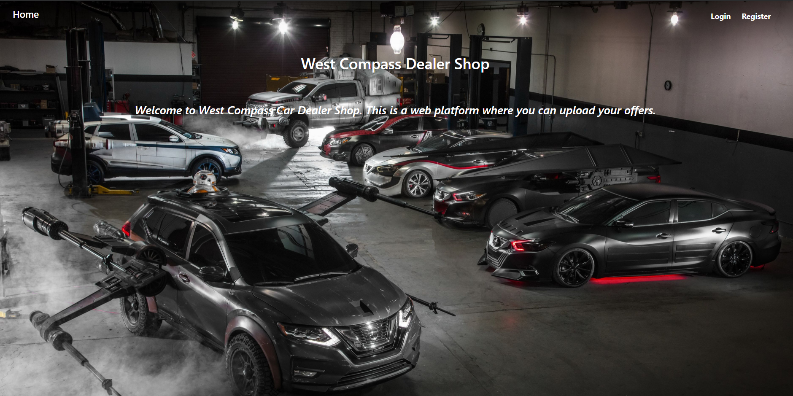
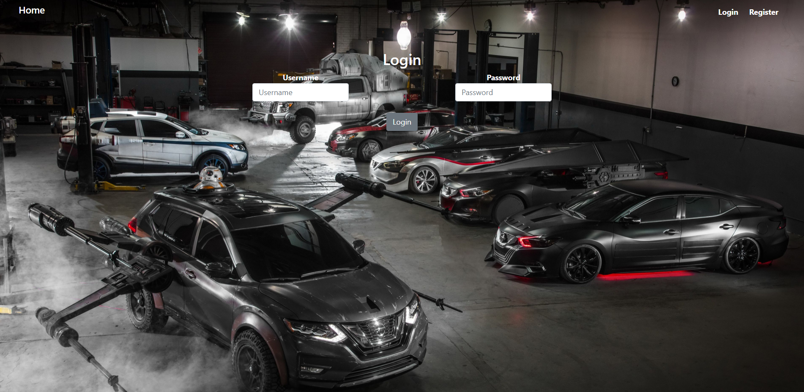
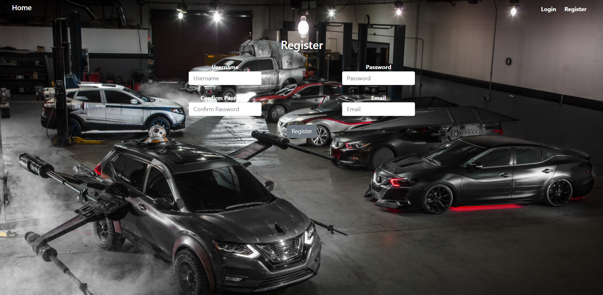
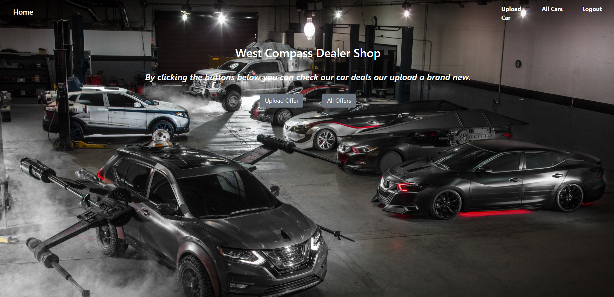
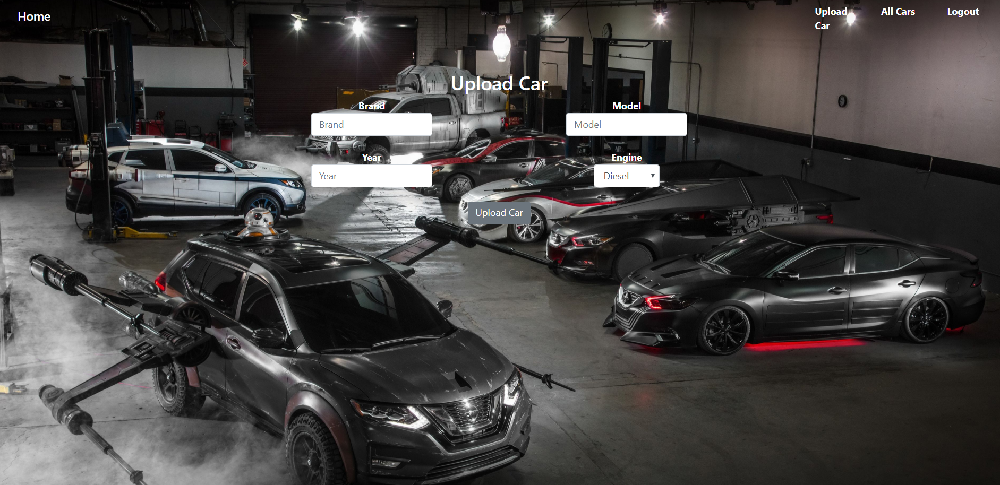
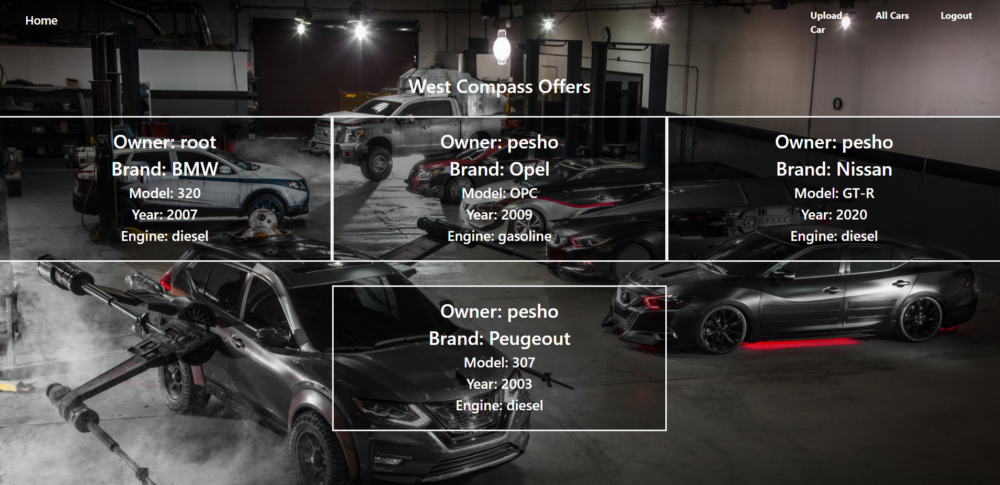

# Java Web Development Basics

## Java EE Workshop – Servlets & JSP

### West Compass Car Dealer Shop

West Compass Dealer Shop is an web application where you can add your car offers. There are two main entities, Users and Cars .

### Database Requirements

The Database of the application needs to support 2 entities:

#### User

- Has a Username
- Has a Password
- Has an Email
- Has Cars (a collection of cars)

#### Car

- Has a Brand
- Has a Model
- Has a Year
- Has an Engine
- Has User

Implement the entities with the correct data-types, and implement repositories for them.

### Templates

#### Index Template (route = “/index”) (logged out user)

 
#### Login Template (route = “/users/login”) (logged out user)

#### Register Template (route = “/users/register”) (logged out user)

#### Home Template (route=”/home”) (logged in user)

#### Cars Create Template (route=”/cars/create”) (logged in user)

#### Cars All Template (route=”/cars/all”) (logged in user)

NOTE: All the templates have been given to you as .html files. You need to make .jsp files from them.

NOTE: The templates do NOT require additional CSS for you to write. Only bootstrap and the given css are enough.

NOTE: To include the proper CSS use "${pageContext.request.contextPath}/css/style.css".

### Functional Requirements

The Functionality Requirements describe the functionality that the Application must support.

For Index you should use exactly "/index" as URL, not "/".

The application should provide Guest (not logged in) users with the functionality to:

- Login
- Register
- View the Index page.

The application should provide Users (logged in) with the functionality to:

- Logout
- Home
- View all Cars (All Cars page)
- Create a Car.

The application should store its data into a MySQL database, using Hibernate native.

### Security Requirements

The Security Requirements are mainly access requirements. Configurations about which users can access specific functionalities and pages.

- Guest (not logged in) users can access Index page.
- Guest (not logged in) users can access Login page.
- Guest (not logged in) users can access Register page.
- Users (logged in) can access Home page.
- Users (logged in) can access Cars Create page.
- Users (logged in) can access Cars All page.
- Users (logged in) can access Logout functionality.

[Resources](../../z_resources/javaee-servlets-workshop)
