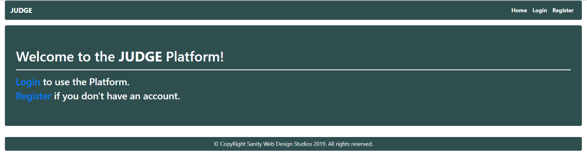
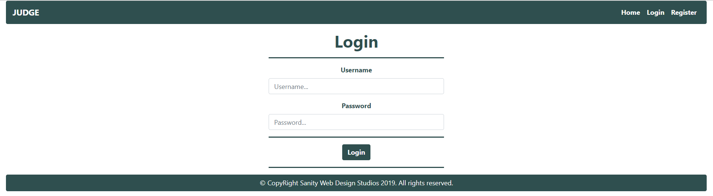
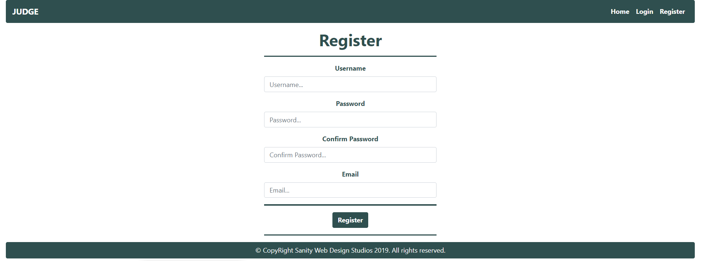
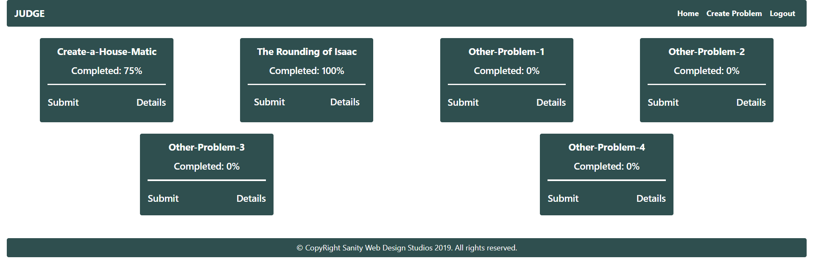
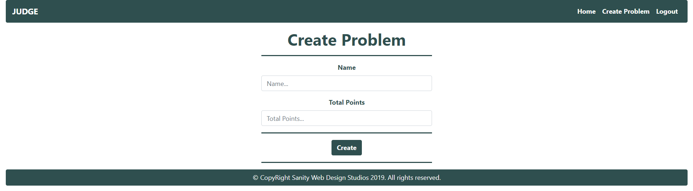
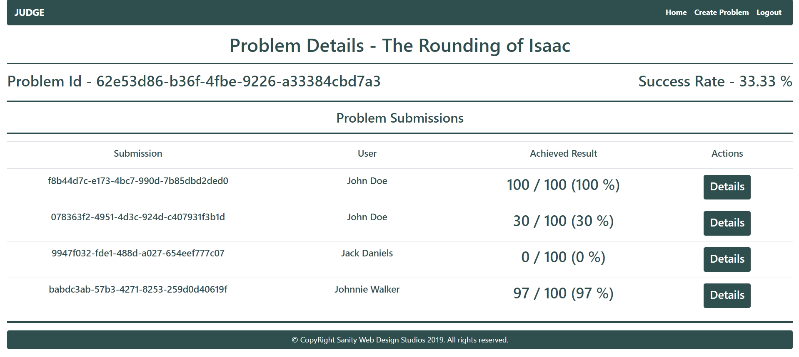
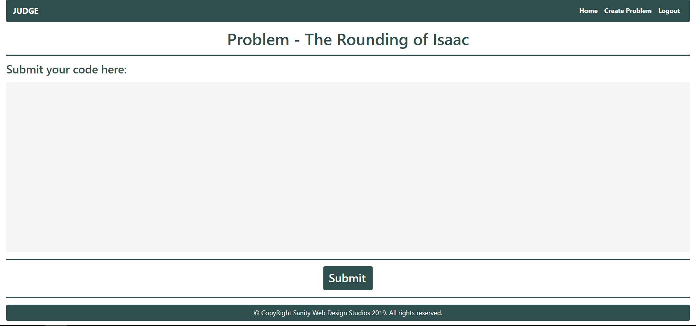
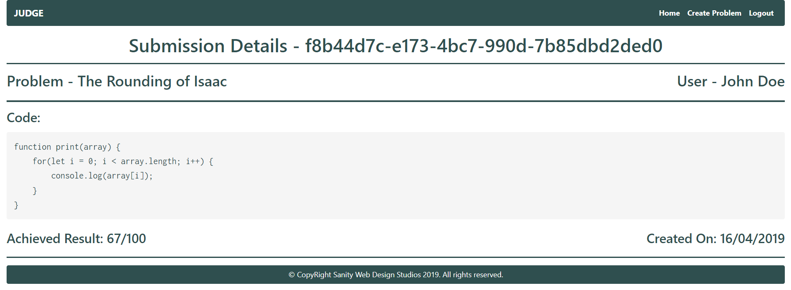

# Java Web Development Basics Retake Exam

## JUDGE

JUDGE (JavaScript Universally Developed Genuine Environments) is an online judge platform which manages problems and submissions of users, only on JavaScript. You have been tasked to implement a platform in which the users can create problems or submit solutions to other users’ problems. Your employers – The SOFTUNI (Software Open-Face Technicians and Universal Naturals Incorporative) have also prepared a bonus task if you prove to be quite handy.

### Database Requirements

The Database of SOFTUNI needs to support 3 entities:

User

- Has an Id – a UUID String
- Has a Username
- Has a Password
- Has an Email

Problem

- Has an Id – a UUID String
- Has a Name – a String
- Has Points– an Integer

Submission

- Has an Id – a UUID String
- Has Code – a List of Strings.
- Has Achieved Result – an Integer
- Has a Created On – a LocalDateTime object
- Has Problem – a Problem object
- Has User – a User object

Implement the entities with the correct data-types and implement repositories for them. 

### Page Requirements

Index Page (logged-out user)

 
Login Page (logged-out user)

 
Register Page (logged-out user)

 
Home Page (logged-in user)

 
NOTE: The Completed field of the Problem blocks is the maximum amount of points the user has achieved with a Submission on that Problem. If the User

NOTE: The `[Submit]` and `[Details]` buttons lead to the Create Submission Page and Details Problem Page respectively.

Problem Create Page (logged-in user)

 
Problem Details Page (logged-in user)

 
NOTE: The Success Rate is the percentage of all Submissions that have achieved maximum result.

NOTE: All Submissions for the current Problem are rendered below in the Problem Submissions section.

NOTE: Submissions are visualized with percentage Achieved Result / Problem Total Points, rounded to the closest integer.

Create Submission Page (logged-in user)

 
NOTE: The Submission Code will be sent from a \<textarea>, as a whole string.

Submission Details Page (logged-in user)

 
The templates have been given to you in the application skeleton, so make sure you implement the pages correctly. 

NOTE: The templates should look EXACTLY as shown above.

NOTE: The templates do NOT require additional CSS for you to write. Only bootstrap and the given css are enough.

### Functionality

The functionality of JUDGE Platform is very simple.

#### Users

Guests can Register, Login and view the Index Page. 

Users can Create Problems and see Created Problems on the Home Page. From the Home Page they can also view Details about each one of those Problems or Submit a Submission to that Problem. Users can also view Submission Details from the table with the Problem Submissions on the Problem Details Page. 

#### Problems

Problems can be Created by Users. All created Problems are visualized on the Home Page, each one in its own separate rectangular element. 

Problems are visualized on the Home Page with a Completed field – which is the highest percentage of points

(Achieved Result) a Submission of the currently logged-in user, has reached on that Problem.

### Example

The currently-logged in user has 3 Submissions on a Problem with 250 Total Points:

- One with 100 Achieved Result
- One with 200 Achieved Result
- One with 50 Achieved Result

The highest is the one with 200 Achieved Result, which is 80 % of 250 (Problem’s Total Points). That means the Completion, for that particular Problem, is 80 %.

Documents are visualized on the Home Page with 2 buttons – `[Submit]` and `[Details]`.

- The `[Submit]` button leads to the Create Submission Page
- The `[Details]` button leads to the Details Page

### Submission

Submissions can be created by Users for a Problem. All created Submissions, for a Problem, are visualized on that Problem’s Details Page.

Submissions’ Code is created from a \<textarea>, which submits a giant text string. However, that value must be split into lines of code and stored into the Code property of the Submission entity, which is a List of Strings.

- Upon creation, the Submission’s Achieved Result property should be set to a random value 

between 0 and the Problem’s Total Points.

- Upon creation, the Submission’s Created On property should be set to the current Date and Time.
- Upon creation, the Submission’s User property should be set to the currently logged-in user.

### Redirects

- Upon successful Registration of a User, you should be redirected to the Login Page.
- Upon successful Login of a User, you should be redirected to the Home Page.
- Upon successful Creation of a Problem, you should be redirected to the Home Page.
- Upon successful Creation of a Submission, you should be redirected to that 

Submission’s Details Page.

- Upon successful Logout of a User, you should be redirected to the Index Page.

General

The application should store its data into a MySQL database, using Hibernate native.

### Security

The Security section mainly describes access requirements. Configurations about which users can access specific functionalities and pages.

- Guest (not logged in) users can access Index page.
- Guest (not logged in) users can access Login page.
- Guest (not logged in) users can access Register page.
- Users (logged in) cannot access Guest pages.
- Users (logged in) can access Home page.
- Users (logged in) can access Problem Create page and functionality.
- Users (logged in) can access Problem Details page.
- Users (logged in) can access Submission Create page and functionality.
- Users (logged in) can access Submission Details page.
- Users (logged in) can access Logout functionality.

### Code Quality

Make sure you provide the best architecture possible. Structure your code into different modules, divide and conquer, follow the principles of high-quality code. You will be scored for the Code Quality and Architecture of your project.

### Bonus

The SOFTUNI has prepared a Bonus task for you.
You have been tasked to compile the code which is submitted into every Submission, as a JavaScript code.
If the JavaScript code’s output is equal to the Problem’s Name, the Submission should automatically get 
100 % Achieved Result (the Achieved Result should be equal to the Problem’s Total Points).
In all other cases, the Submission’s Achieved Result should be generated normally (with a random value between 0 and the Problem’s Total Points).

### Scoring

##### Database – 10 points.

##### Pages – 20 points.

##### Functionality – 40 points.

##### Security – 10 points.

##### Code Quality – 20 points.

##### Bonus – 10 points.

[Resources](../z_resources/judge)